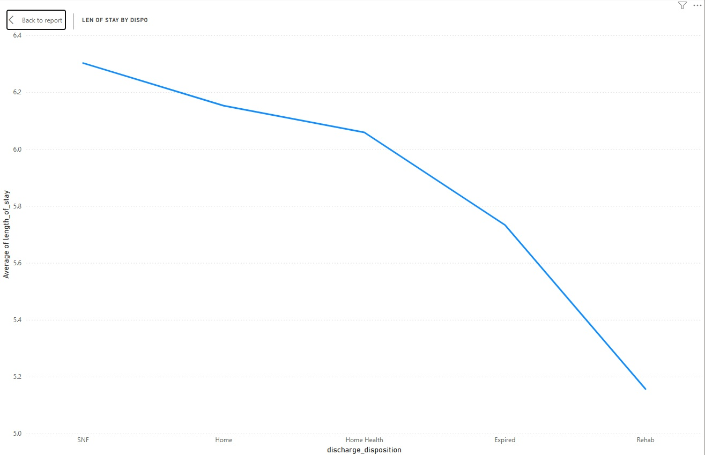
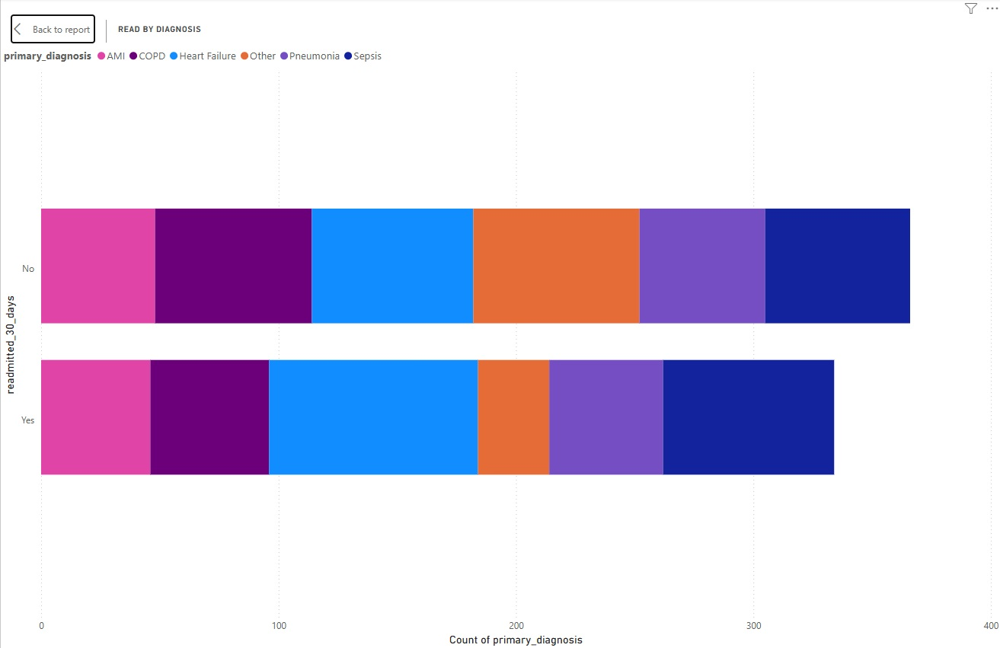
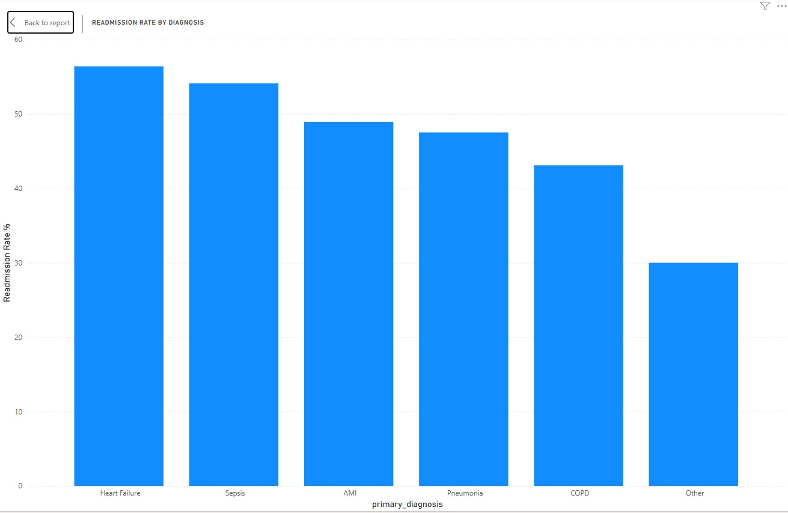
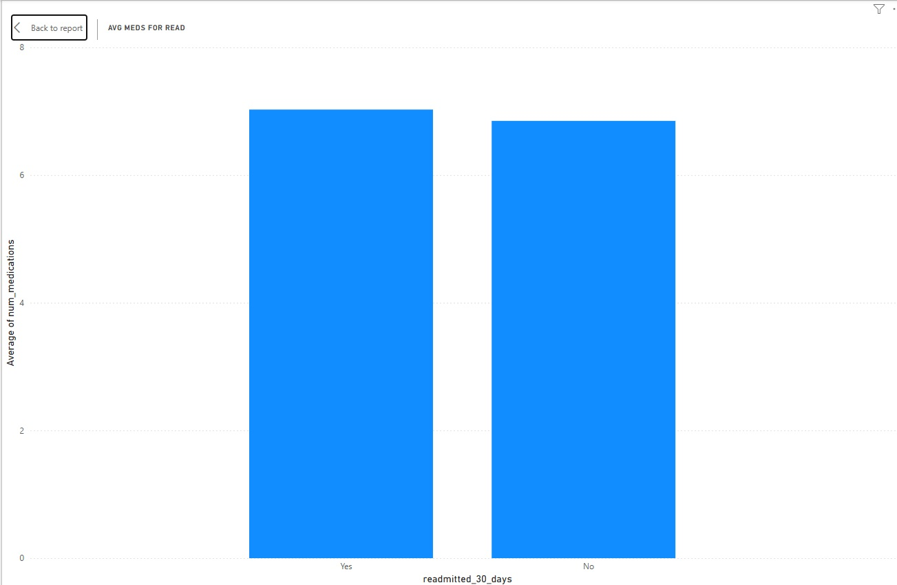
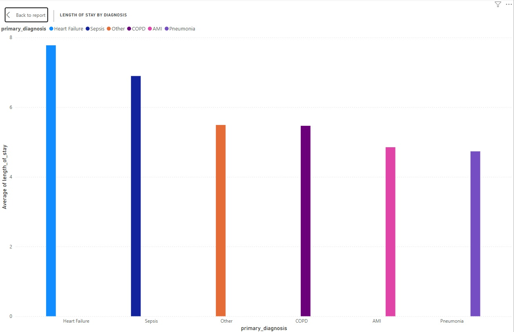
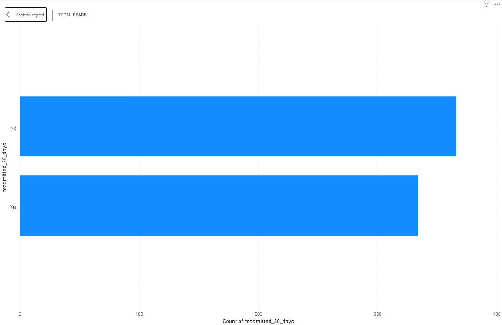

# Hospital Readmission Analysis - Healthcare Data Analytics Portfolio Project

**Project Overview**  
Analysis of hospital readmission patterns using synthetic data modeled after real NYC hospital systems. The goal was to identify key drivers of 30-day readmissions and actionable opportunities to reduce them using my EMT domain knowledge.

## Technologies Used
- Power BI (DAX measures, visualizations)
- Excel (data cleaning & calculated columns)
- Synthetic Data Generation

## Data Cleaning & Preparation Highlights
- Calculated average number of medications ≈ 9.6
- Created `Above_Avg_Meds` column in Excel (`=IF(J2>9,"YES","NO")`)
- Built Readmission Rate % DAX measure

## Key Visuals

*Length of Stay by Discharge Disposition – Rehab shows notably shorter stays*

*Readmission distribution by primary diagnosis*

*Readmission Rate % by Diagnosis – Heart Failure and Sepsis highest risk*

*Average Medications – Similar between readmitted and non-readmitted*

*Average Length of Stay by Diagnosis*

*Overall Readmission Count*

## Key Insights & Findings

- **Heart Failure and Sepsis** are the highest-risk diagnoses, both showing readmission rates above 50% and driving ~40% of all readmissions.
- Average Length of Stay (LOS) has a clear positive correlation with readmission risk.
- Patients discharged to **Rehab** have significantly lower average LOS compared to Skilled Nursing Facilities (SNF).
- Number of medications increases with longer stays but was not a strong standalone predictor of readmission.

**Primary Recommendation:** Focus on reducing unnecessary Length of Stay through better discharge planning and stronger partnerships/audits with rehab facilities.

## Data Gaps Identified
- Time between stabilization and discharge (excess LOS)
- Full secondary diagnoses and comorbidities
- Specific procedures performed
- Patient baseline cognitive status

## Data Sources & Limitations

Primary analysis used **synthetic hospital readmission data** modeled on real NYC hospital patterns from my EMT experience.  

I explored public datasets including:
- **MIMIC-IV Demo** (PhysioNet): [https://physionet.org/content/mimic-iv-demo/](https://physionet.org/content/mimic-iv-demo/)
- Diabetes 130-US Hospitals dataset

The MIMIC-IV demo had limited rows and weak relationships, so synthetic data was used for a complete project.

---